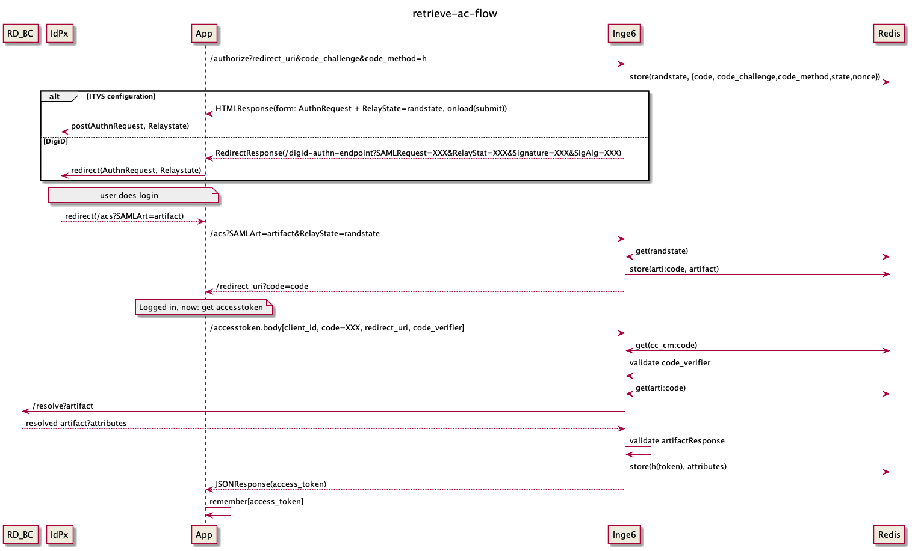

# System summary
Multiple Authentication eXchange (MAX, formerly inge6) is build as a bridge between an OIDC client and a TVS (Toegang Verlenings
Service). In this case the TVS could be DigiD or any other authentication method provider that is exposed through the 
[nl-uzi-login-controller](https://github.com/minvws/nl-uzi-login-controller). To clarify, this means that any authentication
methods other than DigiD, will pass from MAX through the login controller (DigiD Mock included).
Functionally this means that MAX allows an end-user to login into DigiD and provides the app with a token, which can be 
used to retrieve the BSN of that same end-user. This BSN can be used in different ways depending on your use case. For 
instance, it was used for the CoronaCheckApp 
[signing service](https://github.com/minvws/nl-covid19-coronacheck-backend-bizrules-signing-service) to retrieve the 
related vaccination and test data from the existing provider. MAX is also capable of exchanging an encrypted BSN for 
properties from an external register. This functionality is used in the
[UZI project](https://github.com/minvws/nl-rdo-uzi-coordination/), where it exchanges the BSN for data from the UZI 
register.

**Flow:**  
In the diagram below you can see the flow of the first use case (token based). An overview of the used endpoints can 
also be found in the `/docs/endpoints.md`.  

 
 *Throughout the first part of the flow (after /authorize), the call is
 directly linked to some randstate (generated directly after the first call). The latter part of the flow that same
 user is linked using the generated code coupled to that randstate. Using these random state parameters we track the
 user throughout the complete flow, and separate that user from other users interacting with the system*
 *IdPx is an identity provider
 *RD-BC is the (hidden) IdPx Backend providing the artifacts

**OIDC:**  
If you are not familiar with OIDC (OpenID Connect), you can find more about it in broad terms on the 
[OIDC website](https://openid.net/developers/how-connect-works/). More specifically we are using the PKCE flow (RFC 7636)
, which is visualized in the diagram below. 
The diagram is taken from [this medium blog post](https://medium.com/swlh/pkce-flow-of-openid-connect-9b10ddbabd66)
where you can read a more thorough explanation. 
```text
                                          +-------------------+
                                          | Authz Server (MAX)|               
+--------+                                | +---------------+ |
|        |--(A)- Authorization Request ---->|               | |
|        |       + t(code_verifier), t_m  | | Authorization | |
|        |                                | |    Endpoint   | |
|        |<-(B)---- Authorization Code -----|               | |
|  OIDC  |                                | +---------------+ |            
| Client |                                |                   |
|        |                                | +---------------+ |
|        |--(C)-- Access Token Request ---->|               | |
|        |          + code_verifier       | |     Token     | |
|        |                                | |    Endpoint   | |
|        |<-(D)------ Access Token ---------|               | |
+--------+                                | +---------------+ |
                                          +-------------------+
                                               |         ^
                                               |         |
                                               ∀         |
                                          +-------------------+
                                          |        TVS        |
                                          |   e.g. DigiD or   |
                                          | login-controller  |
                                          +-------------------+ 
```


# Setup
If you are looking to set up MAX locally as part of the UZI project, please refer to the instructions in the 
[nl-rdo-uzi-coordination](https://github.com/minvws/nl-rdo-uzi-coordination) repository. For more in depth set up
documentation specifically for MAX you can check the `/docs/setup.md`. Otherwise, you can read the documentation below 
for the basics:  

As MAX is a OIDC <-> SAML bridge, one has to have files for both. Each file is described below. Further, one needs
to create an `max.conf` to define all settings. An example is found in max.conf.example with the corresponding
explanations. To make use of all default settings, a single run of `make setup-local` or `make setup-remote` should be sufficient, allowing you to run the service on all default settings.

## Setup Identity Provider (IDP) Metadata
To use DigiD or TVS you first need to download the metadata. During setup this is done in the make setup or make
metadata step. This can manually be done using curl or another downloading tool. The URLs for the pre-production
environment are included below as a reference.
```
curl "https://was-preprod1.digid.nl/saml/idp/metadata" --output saml/digid/metadata/idp_metadata.xml
curl "https://pp2.toegang.overheid.nl/kvs/rd/metadata" --output saml/tvs/metadata/idp_metadata.xml
```

## JWT keys
MAX needs two keys to encrypt and sign the JWT containing the BSN details. This is an Ed25519 keypair on MAX's part,
and a X25519 keypair for the requesting party. The requesting party would be [inge4](https://github.com/minvws/nl-covid19-coronacheck-credential-issuer)
in the case of the CoronaCheck app and the [nl-uzi-login-controller](https://github.com/minvws/nl-uzi-login-controller)
for the UZI project. To generate an Ed25519 keypair one can perform the following code:
```python
import base64
from cryptography.hazmat.primitives.asymmetric.ed25519 import Ed25519PrivateKey, Ed25519PublicKey
from cryptography.hazmat.primitives import serialization

# To generate a new key
privkey = Ed25519PrivateKey.generate()
privkey_bytes = privkey.private_bytes(
    encoding=serialization.Encoding.Raw,
    format=serialization.PrivateFormat.Raw,
    encryption_algorithm=serialization.NoEncryption()
)

# print base64 private key
base64_privkey = base64.b64encode(privkey_bytes)

# To load a key from a base64 encoded key
privkey_bytes = base64.b64decode(base64_privkey)
privkey = Ed25519PrivateKey.from_private_bytes(privkey_bytes)

# To get the pubkey
pubkey_bytes = privkey.public_key().public_bytes(
    encoding=serialization.Encoding.Raw,
    format=serialization.PublicFormat.Raw
)
base64_pubkey = base64.b64encode(pubkey_bytes)
```

The code is identical for creating a X25519 key, but then just needs a different import (and use the similar classes
for loading and generation of the keys):
```python
from cryptography.hazmat.primitives.asymmetric.x25519 import X25519PrivateKey, X25519PublicKey
```

## Ubuntu dependencies
13/07/2023:
Most likely still needed but can not confirm since I am running MacOS. Please update accordingly.  
Some Ubuntu dependencies that should be installed:
`libxmlsec1-dev pkg-config`

# Using the ratelimiter
To activate an overflow IDP, secondary IDP when primary is too busy, the following settings should be configured in
the max.conf settings.

Further redis expects the keys configured in the config to have a valid value. The keys expected to be set are defined
in the config under the following names:
- `primary_idp_key`
- `user_limit_key` (if there is a user limit to be handled by the ratelimiter)

Optionally, to enable ratelimit overflow, extra keys are expected to be set. The names of these keys are defined in the
config under the following config names:
- `overflow_idp_key`
- `user_limit_key_overflow_idp` (if there is a user limit on the overflow idp to be handled by the ratelimiter)


# Using the mock environment
For development purposes we have created a 'mock' to retrieve a JWT Token for arbitrary BSNs. This is only available 
when `digid_mock` has been added to the `login_methods` in the `max.conf` and the set `environment` does not
start with 'prod'. Note that in the case of `environment = production` the option will still show up, but under the hood
it will disable the mock (taken from the `handle_assertion_consumer_service` method in the `SAMLProvider` class):   
```Python
if (
    not self._environment.startswith("prod")
    and authentication_context.authentication_method == "digid_mock"
):
    artifact_response: ArtifactResponse = ArtifactResponseMock(request.SAMLart)
else:
    artifact_response = identity_provider.resolve_artifact(request.SAMLart)
```
Configuring this adds a DigiD Mock option to the "login method chooser page". When clicking this option a 
simple page will show with an input element in which you can enter your desired BSN value. You can then simply press "login".
It will then try to retrieve mock data based on this BSN from the `mock_register.json` in the
[nl-uzipoc-register-api](https://github.com/minvws/nl-uzipoc-register-api/) repository. When this is successful your login 
will be complete and allow for the same functionality as any of the other methods.

It is the responsibility of the client to generate a unique code_verifier and code_challenge pair. To make sure that
the code_verifier is cryptographically secure one should use the following definition (as defined in:
https://datatracker.ietf.org/doc/html/rfc7636#section-4.1):
```
code_verifier = high-entropy cryptographic random STRING using the
unreserved characters [A-Z] / [a-z] / [0-9] / "-" / "." / "_" / "~"
from Section 2.3 of [RFC3986], with a minimum length of 43 characters
and a maximum length of 128 characters.
```

To find the code in this library used for verifying the code_verifier and code_challenge pair, have a look at the code
snippet highlighted in the following github permalink:
https://github.com/minvws/nl-rdo-max/blob/e858cb2807cd270d3ca7e9c67b7fccc556a0f91d/inge6/oidc/authorize.py#L17-L49

This snippet verifies the pair as defined in https://datatracker.ietf.org/doc/html/rfc7636#section-4.2

## Development & Contribution process

The development team works on the repository in a private fork (for reasons of compliance with existing processes) and
shares its work as often as possible.

If you plan to make non-trivial changes, we recommend to open an issue beforehand where we can discuss your planned
changes. This increases the chance that we might be able to use your contribution (or it avoids doing work if there
are reasons why we wouldn't be able to use it).

Note that all commits should be signed using a gpg key.

## Security

Security issues can be reported through a github issue, at security@rdobeheer.nl, or through the
https://www.ncsc.nl/contact/kwetsbaarheid-melden.


## Logging and monitoring
The Logging/monitoring of data processing are, on the one hand, important measures to detect,
among other things, unauthorized access to personal data. On the other hand, Logging/monitoring
constitutes new processing of personal data, with associated privacy risks. Therefore, 
the question of how logging/monitoring should be set up requires consideration.

With regard to this application, the choice has been made not to log data processing because:

* Processing of personal data within this application takes place encrypted.
* Users do not have access to personal data processed within this application,
and they cannot undo the encryption.
* Logging of data processing within this application is not necessary in light of 
the obligation of healthcare providers to be able to comply with their obligation
to record actions related to the electronic patient record.

### Docker containers
Docker containers and their configurations are meant to be used for development purposes only. And not meant to be used in a production setup. 


