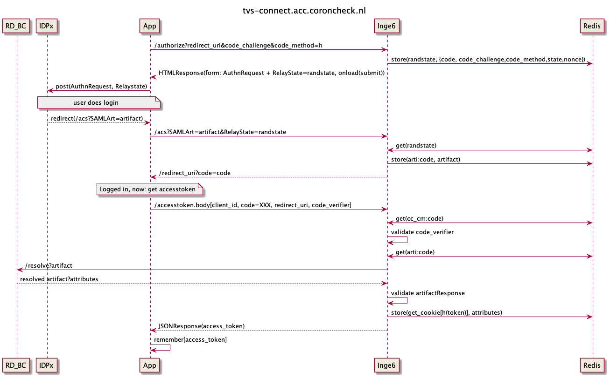

# In this document the requests overview for this system is described:
The inge6 happy flow is described in the image shown below.

For this service the standard OpenID Connect protocol is implemented, it is therefore recommended to use an OpenID Connect client library to communicate with this service.

Either way, as we are using the code authorization flow, two requests are required to access the resource:
- /authorize?...
- /accesstoken?...

The `/authorize` endpoint provides the client with an authorization code, which can be exchanged for an access token using the `/accesstoken` endpoint.